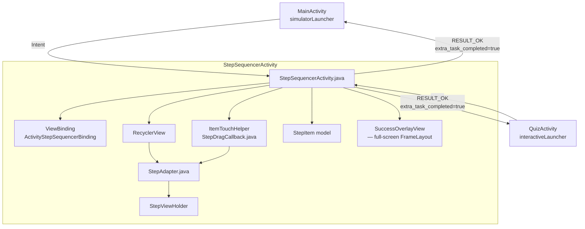
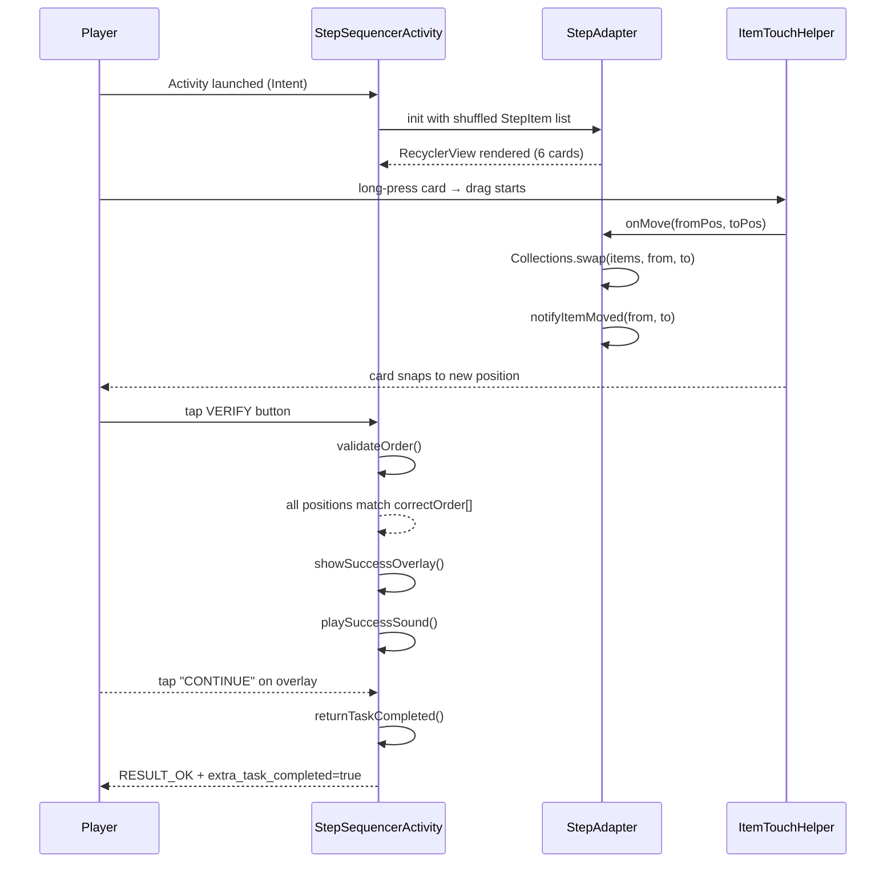
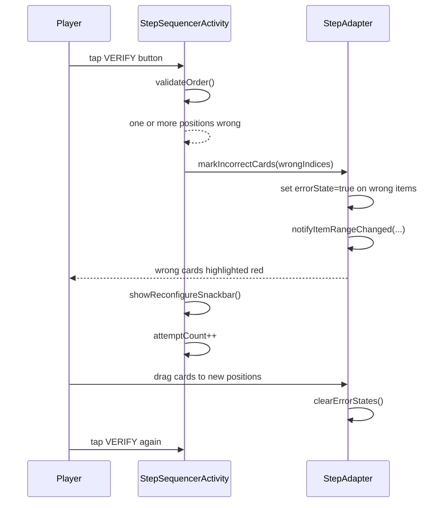

# Design Document: StepSequencerActivity

## Overview

`StepSequencerActivity` is a drag-to-reorder interactive mission for the **Server Master NC II** cyberpunk quiz game. The player is presented with six shuffled RDP configuration steps and must drag them into the correct sequence before tapping **VERIFY**. The activity returns `RESULT_OK` with `extra_task_completed = true` only when the player submits the correct order, integrating seamlessly with the existing `simulatorLauncher` / `interactiveLauncher` pattern used by `MainActivity` and `QuizActivity`.

The feature is scoped to level **2.10 — Remote Desktop / RDP Configuration** and follows the same cyberpunk aesthetic (background `#0A0F0A`, neon green `#39FF7F`, monospace font) and ViewBinding + MaterialCardView conventions already established in the project.

---

## Architecture



---

## Sequence Diagrams

### Happy Path — Correct Submission



### Wrong Submission — Retry Flow



---

## Components and Interfaces

### StepSequencerActivity

**Purpose**: Host activity — owns lifecycle, validation logic, result dispatch, and overlay management.

**Interface** (public contract with the rest of the app):
```java
public class StepSequencerActivity extends AppCompatActivity {
    public static final String EXTRA_TASK_COMPLETED = "extra_task_completed";
    // launched via standard Intent; no required extras
}
```

**Responsibilities**:
- Inflate `activity_step_sequencer.xml` via ViewBinding
- Build the shuffled `List<StepItem>` and pass it to `StepAdapter`
- Attach `ItemTouchHelper` with `StepDragCallback` to the RecyclerView
- Handle VERIFY button click → call `validateOrder()`
- Show success overlay or error feedback
- Track `attemptCount` (no limit, informational only)
- Call `returnTaskCompleted()` on correct submission

---

### StepItem (Data Model)

**Purpose**: Immutable value object representing one draggable step card.

```java
public class StepItem {
    private final int originalIndex;   // 0-based position in correctOrder
    private final String stepText;     // instruction text shown on card
    private boolean errorHighlighted;  // true when card is in wrong position after VERIFY

    public StepItem(int originalIndex, String stepText) { ... }
    public int getOriginalIndex() { ... }
    public String getStepText() { ... }
    public boolean isErrorHighlighted() { ... }
    public void setErrorHighlighted(boolean highlighted) { ... }
}
```

**Validation Rules**:
- `originalIndex` must be in range [0, 5]
- `stepText` must be non-null and non-empty
- `errorHighlighted` defaults to `false`

---

### StepAdapter

**Purpose**: `RecyclerView.Adapter` that renders `StepItem` objects as cyberpunk `MaterialCardView` rows and exposes a drag-start hook.

```java
public class StepAdapter extends RecyclerView.Adapter<StepAdapter.StepViewHolder> {

    public interface DragStartListener {
        void onDragStart(RecyclerView.ViewHolder viewHolder);
    }

    public StepAdapter(List<StepItem> items, DragStartListener dragStartListener) { ... }

    // Called by ItemTouchHelper.Callback during drag
    public void onItemMove(int fromPosition, int toPosition) { ... }

    // Called before VERIFY to clear all red highlights
    public void clearErrorStates() { ... }

    // Called after failed VERIFY to highlight wrong cards
    public void markErrorAt(int adapterPosition) { ... }

    // Returns current ordered list for validation
    public List<StepItem> getItems() { ... }

    @Override public StepViewHolder onCreateViewHolder(ViewGroup parent, int viewType) { ... }
    @Override public void onBindViewHolder(StepViewHolder holder, int position) { ... }
    @Override public int getItemCount() { ... }

    class StepViewHolder extends RecyclerView.ViewHolder {
        // item_step_card.xml via ViewBinding (ItemStepCardBinding)
        ItemStepCardBinding binding;
        StepViewHolder(ItemStepCardBinding b) { ... }
    }
}
```

**Responsibilities**:
- Bind step number badge (position + 1) and step text to each card
- Apply neon green stroke on normal state; red stroke + red tint on error state
- Wire drag handle `ImageView` long-press → `DragStartListener.onDragStart()`
- Swap items in-place via `Collections.swap()` + `notifyItemMoved()`

---

### StepDragCallback

**Purpose**: `ItemTouchHelper.Callback` subclass that enables vertical drag-reorder and disables swipe-to-dismiss.

```java
public class StepDragCallback extends ItemTouchHelper.Callback {

    public StepDragCallback(StepAdapter adapter) { ... }

    @Override public int getMovementFlags(RecyclerView rv, RecyclerView.ViewHolder vh) {
        // drag: UP | DOWN   swipe: none
    }

    @Override public boolean onMove(RecyclerView rv,
                                    RecyclerView.ViewHolder dragged,
                                    RecyclerView.ViewHolder target) {
        // delegate to adapter.onItemMove(from, to)
    }

    @Override public void onSwiped(RecyclerView.ViewHolder vh, int direction) {
        // no-op — swipe disabled
    }

    @Override public boolean isLongPressDragEnabled() {
        // return false — drag is initiated manually via drag handle
    }
}
```

---

## Data Models

### Correct Sequence (source of truth)

```java
// Defined as a constant in StepSequencerActivity
private static final String[] STEP_TEXTS = {
    "Open Server Manager",
    "Add Remote Desktop Services Role",
    "Configure Network Level Authentication (NLA)",
    "Open Windows Firewall and allow port 3389",
    "Add users to Remote Desktop Users group",
    "Test connection using mstsc.exe"
};

// Validation array — indices 0..5 in order
private static final int[] CORRECT_ORDER = {0, 1, 2, 3, 4, 5};
```

### Shuffle Strategy

```java
// Build ordered list, then shuffle
List<StepItem> items = new ArrayList<>();
for (int i = 0; i < STEP_TEXTS.length; i++) {
    items.add(new StepItem(i, STEP_TEXTS[i]));
}
Collections.shuffle(items);
// Guarantee shuffle actually changed order (retry if identical)
while (isAlreadyCorrect(items)) {
    Collections.shuffle(items);
}
```

---

## Algorithmic Pseudocode

### validateOrder()

```pascal
PROCEDURE validateOrder()
  INPUT:  currentItems — ordered List<StepItem> from adapter
  OUTPUT: isCorrect — boolean; side-effects: error highlights, overlay, snackbar

  SEQUENCE
    wrongPositions ← empty List<Integer>
    
    FOR i ← 0 TO currentItems.size() - 1 DO
      item ← currentItems.get(i)
      IF item.getOriginalIndex() ≠ CORRECT_ORDER[i] THEN
        wrongPositions.add(i)
      END IF
    END FOR
    
    IF wrongPositions.isEmpty() THEN
      // Correct!
      adapter.clearErrorStates()
      showSuccessOverlay()
      playSuccessSound()
      RETURN true
    ELSE
      // Wrong — highlight bad cards
      adapter.clearErrorStates()
      FOR EACH pos IN wrongPositions DO
        adapter.markErrorAt(pos)
      END FOR
      adapter.notifyDataSetChanged()
      attemptCount ← attemptCount + 1
      showReconfigureSnackbar(wrongPositions.size())
      RETURN false
    END IF
  END SEQUENCE
END PROCEDURE
```

**Preconditions**:
- `adapter.getItems()` returns a list of exactly 6 `StepItem` objects
- `CORRECT_ORDER` is `{0, 1, 2, 3, 4, 5}`

**Postconditions**:
- If correct: success overlay is visible, no error highlights remain
- If wrong: exactly the cards at `wrongPositions` have `errorHighlighted = true`
- `attemptCount` is incremented only on wrong submissions

**Loop Invariant**: For all `j < i`, `wrongPositions` contains exactly the indices where `items[j].originalIndex ≠ CORRECT_ORDER[j]`

---

### onItemMove() — drag reorder

```pascal
PROCEDURE onItemMove(fromPosition, toPosition)
  INPUT:  fromPosition — int, source adapter index
          toPosition   — int, destination adapter index
  OUTPUT: items list mutated; RecyclerView notified

  SEQUENCE
    ASSERT 0 ≤ fromPosition < items.size()
    ASSERT 0 ≤ toPosition   < items.size()
    
    Collections.swap(items, fromPosition, toPosition)
    notifyItemMoved(fromPosition, toPosition)
    
    // Clear any lingering error highlights on move
    // (player is actively reconfiguring)
    FOR EACH item IN items DO
      item.setErrorHighlighted(false)
    END FOR
  END SEQUENCE
END PROCEDURE
```

**Preconditions**: Both positions are valid indices into `items`
**Postconditions**: `items[fromPosition]` and `items[toPosition]` are swapped; all error highlights cleared
**Loop Invariant**: N/A (single swap, not iterative)

---

### showSuccessOverlay()

```pascal
PROCEDURE showSuccessOverlay()
  SEQUENCE
    overlayContainer.setVisibility(VISIBLE)
    overlayContainer.setAlpha(0f)
    overlayContainer.animate()
      .alpha(1f)
      .duration(400ms)
      .start()
    
    // Animate "SEQUENCE CONFIRMED" text with overshoot
    tvSequenceConfirmed.setVisibility(VISIBLE)
    tvSequenceConfirmed.setScaleX(0.5f)
    tvSequenceConfirmed.setScaleY(0.5f)
    tvSequenceConfirmed.animate()
      .scaleX(1f).scaleY(1f).alpha(1f)
      .duration(600ms)
      .interpolator(OvershootInterpolator(1.5f))
      .start()
    
    // Reveal continue button after 800ms delay
    handler.postDelayed(
      { btnContinue.setVisibility(VISIBLE) },
      800ms
    )
  END SEQUENCE
END PROCEDURE
```

---

## Key Functions with Formal Specifications

### returnTaskCompleted()

```java
private void returnTaskCompleted()
```

**Preconditions**:
- `validateOrder()` returned `true` (correct sequence confirmed)

**Postconditions**:
- `setResult(Activity.RESULT_OK, intent)` called with `intent.getBooleanExtra("extra_task_completed") == true`
- `finish()` called — activity is removed from back stack
- Caller (`MainActivity.simulatorLauncher` or `QuizActivity.interactiveLauncher`) receives `RESULT_OK`

**Side Effects**: Activity finishes; no further UI updates possible

---

### isAlreadyCorrect(List\<StepItem\> items)

```java
private boolean isAlreadyCorrect(List<StepItem> items)
```

**Preconditions**: `items.size() == 6`

**Postconditions**:
- Returns `true` iff `∀ i ∈ [0,5]: items.get(i).getOriginalIndex() == CORRECT_ORDER[i]`
- Returns `false` otherwise
- No mutations to `items`

---

### markErrorAt(int adapterPosition)

```java
public void markErrorAt(int adapterPosition)  // in StepAdapter
```

**Preconditions**: `0 ≤ adapterPosition < items.size()`

**Postconditions**:
- `items.get(adapterPosition).isErrorHighlighted() == true`
- Card at `adapterPosition` renders with red stroke (`#F44336`) and red background tint
- All other cards unaffected

---

## Layout Structure

### activity_step_sequencer.xml

```
ConstraintLayout (bg: #0A0F0A, full screen)
├── TextView tvTitle
│     "ARRANGE THE RDP CONFIGURATION STEPS IN THE CORRECT ORDER"
│     monospace, neon green, center-aligned, top of screen
│
├── RecyclerView rvSteps
│     vertical LinearLayoutManager
│     clipToPadding=false, paddingBottom=16dp
│     fills remaining space between title and button
│
├── MaterialButton btnVerify
│     text: "VERIFY"
│     always enabled
│     neon green background, dark text, monospace
│     pinned to bottom of screen
│
└── FrameLayout overlayContainer (GONE initially)
      background: #CC000000 (semi-transparent black)
      full-screen, elevation above RecyclerView
      ├── TextView tvSequenceConfirmed
      │     "SEQUENCE CONFIRMED"
      │     large, bold, neon green, monospace, centered
      └── MaterialButton btnContinue
            text: "CONTINUE"
            neon green, centered below tvSequenceConfirmed
```

### item_step_card.xml

```
MaterialCardView
  strokeColor: cyber_neon_green (#39FF7F) — normal state
  strokeColor: #F44336 — error state (set programmatically)
  cardBackgroundColor: #111620 (cyber_card_surface)
  cornerRadius: 8dp
  margin: 8dp horizontal, 4dp vertical

  ConstraintLayout
  ├── TextView tvStepBadge
  │     step number (1–6), circular neon green badge, left side
  │     monospace, bold
  │
  ├── TextView tvStepText
  │     instruction text, center of card
  │     monospace, white/light text
  │
  └── ImageView ivDragHandle
        ic_drag_handle vector, right side
        tint: cyber_neon_green
        triggers drag on long-press
```

---

## Error Handling

### Wrong Order Submission

**Condition**: Player taps VERIFY and one or more cards are out of position
**Response**: Cards at wrong positions get red stroke + red background tint; Snackbar shows "RECONFIGURE — X STEPS OUT OF SEQUENCE"
**Recovery**: Player drags cards; error highlights clear automatically on any drag move; player can re-submit unlimited times

### Already-Correct Shuffle Guard

**Condition**: `Collections.shuffle()` produces the correct order by chance
**Response**: Re-shuffle until order differs from `CORRECT_ORDER`
**Recovery**: Automatic — loop retries until a genuinely shuffled order is produced

### Activity Back Press

**Condition**: Player presses back without completing the mission
**Response**: `setResult(RESULT_CANCELED)` (default) — no `extra_task_completed` extra set
**Recovery**: Caller receives `RESULT_CANCELED`; no score awarded; level remains locked

---

## Testing Strategy

### Unit Testing Approach

- Test `validateOrder()` with all 720 permutations of 6 items — only the identity permutation should return `true`
- Test `isAlreadyCorrect()` with correct order → `true`; any swap → `false`
- Test `onItemMove()` swap correctness and error-state clearing
- Test shuffle guard: mock `Collections.shuffle` to return correct order first, verify retry

### Property-Based Testing Approach

**Property Test Library**: JUnit 4 with parameterized tests (project uses JUnit 4 per `build.gradle`)

**Properties to verify**:
1. `∀ permutation p of [0..5]: validateOrder(p) == true ↔ p == [0,1,2,3,4,5]`
2. `∀ swap (i,j) where i≠j: isAlreadyCorrect(swapped) == false`
3. After `onItemMove(from, to)`: `items[from].originalIndex == pre_items[to].originalIndex` and vice versa
4. After any `onItemMove`: all `errorHighlighted` flags are `false`

### Integration Testing Approach

- Launch `StepSequencerActivity` via `ActivityScenario` (Espresso)
- Verify RecyclerView shows 6 items
- Verify VERIFY button is always enabled
- Simulate correct drag order → verify `RESULT_OK` with `extra_task_completed=true`
- Simulate wrong order → verify red highlights appear and no result is returned

---

## Performance Considerations

- RecyclerView with 6 fixed items — no pagination or lazy loading needed
- `notifyItemMoved()` used instead of `notifyDataSetChanged()` during drag for smooth animation
- `notifyDataSetChanged()` used only after bulk error-state changes (post-VERIFY)
- Overlay is a simple `FrameLayout` with `GONE/VISIBLE` toggle — no fragment transactions

---

## Security Considerations

- No network calls; no user data persisted beyond the `RESULT_OK` intent extra
- Result extra `extra_task_completed` is a boolean — no injection surface
- Activity does not accept any sensitive input extras

---

## Dependencies

| Dependency | Version | Purpose |
|---|---|---|
| `androidx.recyclerview:recyclerview` | `1.3.2` | Drag-reorder list (already in `build.gradle`) |
| `com.google.android.material:material` | (via `libs.material`) | `MaterialCardView`, `MaterialButton`, `Snackbar` |
| `androidx.viewbinding` | (via `buildFeatures.viewBinding`) | Type-safe view access |
| `com.airbnb.android:lottie` | `6.7.1` | Optional: success animation (already in project) |

No new dependencies required — all are already declared in `app/build.gradle`.

---

## Integration with MainActivity (Level 2.10)

`MainActivity.onLevelClick()` currently routes level `2.10` to `QuizActivity` as a `Standard_Quiz`. To wire `StepSequencerActivity` as the interactive gate for level `2.10`, add a case to the `simulatorLauncher` routing switch:

```java
case "2.10":
    pendingSimulatorLevelId = levelId;
    simulatorLauncher.launch(new Intent(this, StepSequencerActivity.class));
    return;
```

And add `StepSequencerActivity` to `QuizActivity.getSimulatorForLevel()`:

```java
case "2.10": return StepSequencerActivity.class;
```

And register in `AndroidManifest.xml`:

```xml
<activity
    android:name=".StepSequencerActivity"
    android:screenOrientation="portrait"
    android:exported="false" />
```
